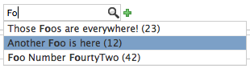

.. django-widgetry documentation master file, created by
   sphinx-quickstart on Sun Oct  9 14:48:01 2011.
   You can adapt this file completely to your liking, but it should at least
   contain the root `toctree` directive.

===========================================
Welcome to django-widgetry's documentation!
===========================================

`django-widgetry` contains a small collection of widgets and extensions for use in `django.contrib.admin`.

Widgets Overview
================

tabs
----

.. figure:: _static/tabs_example1.png
   :scale: 50 %
   :alt: tabs example screenshot

   Tabs extension for ``ModelAdmin`` that extends the existing ``fieldsets`` with the possibility to layout the fields
   in individual tabs.

See :ref:`tabs` for full documentation.

fk_lookup
---------

   an autocomplete ``ForeignKey`` lookup widget.

See :ref:`fk_lookup` for full documentation.

Installation
============

The easiest way to install django-widgetry is with `pip` from `pypi`::

	pip install django-widgetry

Or download the Sourcecode from http://github.com/stefanfoulis/django-widgetry/

All JS resources are included in the ``static`` directory. If you are experiencing conflicts with multiple versions
of the same JS being loaded, the ``WIDGETRY_JQUERY_URLS`` setting can be overridden. See ``widgetry.config`` for a list
of all keys that need to be defined.

See the documentation of the individual widgets on how to configure them.

Contents
========

.. toctree::
   :maxdepth: 1

   tabs
   fk_lookup

