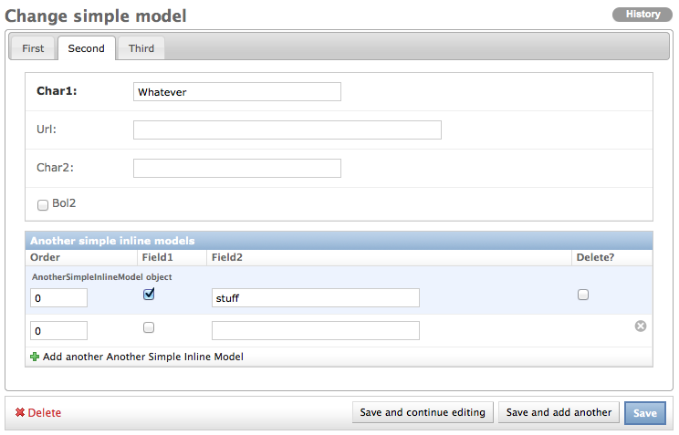

.. _tabs:

tabs
====

See the ``widgetry_example`` app for full sourcecode.

``ModelAdminWithTabs`` adds an extra layer of ui layout on top of the existing ``fieldsets``. Defining it is simple:

.. literalinclude:: ../widgetry_example/admin.py
   :linenos:
   :pyobject: SimpleModelAdmin

The tabs definition consists of a list of tuples. The first part of each tuple is the name of the tab. The second is
dictionary defining the contents.

* ``fieldsets``: same data structure as ``ModelAdmin.fieldsets``.
* ``inlines``: same data structure as ``ModelAdmin.inlines``.

